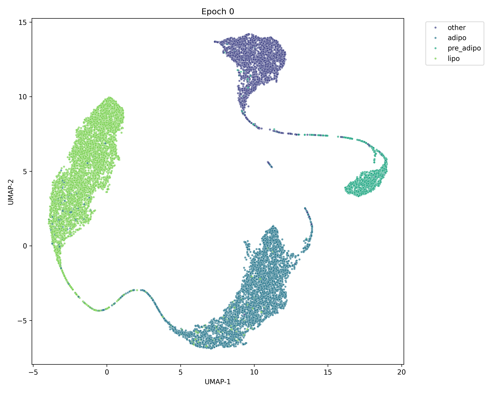
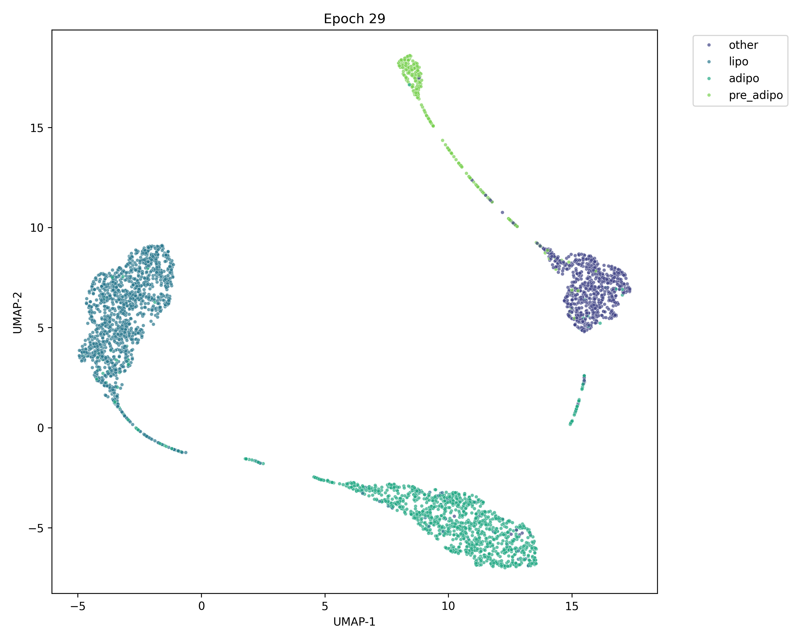

# Transition Model pipeline

## Phase 1: Centered Latent Autoencoder.
### Vanilla AE
This step has been already implemented. We generate a "good" latent representation from our single-cell data, that can be reconstructed into the original state. Later we will work in this latent encoded state. The formulation is:  
$Z = E_{\theta}(X)$,  
where Z is the latent representation of single-cell gene expression vector X, $E_{\theta}$ is the encoder network parametrized by $\theta$ parameters. As an autoencoder we will encode non-perturbed and perturbed data into latent space and then reconstruct them to real space.  
$Z = E_{\theta}(X), \hat{X} = D_{\phi}(Z)$  
This pipeline is evaluated by a mean squared error loss: $\mathcal{L}_{MSE}$.

### Class preserving.
When we create latent representation vectors, the class information can be mashed up, vanish, since the model is not told to keep that information.My approach to regularize the latent space by a GAN-like critic. For every gene, we also know their class $C$, which we can predict in latent space.

$\hat{C}_i = CL_{\Psi}(Z_i)$  
And then calculate the classification loss:
$\mathcal{L}_{class} = CE(\hat{C}_i,C_i)$  
We add this loss to the original loss, therefore the model needs to learn class preserving representation.

### Centroid generation
Simple autoencoders doesn't regularize their latent space, one solution to this problem is the Varriational Autoencoder pipeline. I will not go too much into detail, but I had to realize that approach will not work in this case.Unfortunatelly class preserving information, does not mean distinguishable latent clustering. 
We added Centering loss which enforces to create latent space where classes are in separable clusters.
  
  
Note: First image does not show a full training, but in a fully trained model the results are similar. This is just an illustration of how unclustered latent space looks like.

### Final Loss
The whole loss function is made up from these main components and some minor regularizations, so the weights will not explode.

## Phase 2: Perturbation modelling.
Originally I thought to use an embedding model to embed perturbation effects into latent space as a condition and process it with a latent transition transformer model. From my current understandning perturbations can have different range of silencing effect, from small to total gene expression shut down. Latent embedding could be usefull and maybe able to model the transition effects. For unseen genes I should add perturbation embedding with a pretrained model. Current option I know of: GENE2VEC.

### Cycle Transformer
Since we only have unpaired data we can't directly train a supervised latent transition model. Instead I will use a CycleConsistent Latent Transformer model. This means that every latent vector(control and perturbed) will be transformed into their counterpart and then back.  
$T^{fwd}_{\Theta_1}(Z_{ctrl})=Z_{pert}$  
$T^{bwd}_{\Theta_2}(Z_{pert})=Z_{ctrl}$  
Then we add a cycle consistency loss:  
$\mathcal{L}_{cycle} = MSE(Z_{ctrl},T^{bwd}_{\Theta_2}(T^{fwd}_{\Theta_1}(Z_{ctrl}))) + MSE(Z_{pert},T^{fwd}_{\Theta_1}(T^{bwd}_{\Theta_2}(Z_{pert})))$

### Class Consistency
To further regularize the transition model, I added a class consistency loss. After transforming a latent vector into its counterpart, the class should remain the same. Therefore we can use the pretrained latent classifier from phase 1 to predict the class of transformed latent vectors.  
$\hat{C}_{pert} = CL_{\Psi}(T^{fwd}_{\Theta_1}(Z_{ctrl}))$  
$\hat{C}_{ctrl} = CL_{\Psi}(T^{bwd}_{\Theta_2}(Z_{pert}))$  
Then we can calculate the classification loss for both transformed latent vectors:  
$\mathcal{L}_{class\_trans} = CE(\hat{C}_{pert},C_{ctrl}) + CE(\hat{C}_{ctrl},C_{pert})$

### Adversarial Traning
This transition model could learn simple identity mapping, where  
$\hat{Z}=T^{fwd,bwd}_{\Theta_1, \Theta_2}(Z_{ctrl,pert}) = Z_{ctrl,pert}$.

To avoid this I added an extra discriminator $D_{\phi}$ network in latent space, which tries to classify real and fake (transformed) latent vectors.

 To increase discriminator performance the perturbation index is added to the inputs, therefore it can identify if the transition model is actually changing the latent vector or not. There is a possibility that some perturbed state are indistinguishable from control state, but in this case the perturbation doesn't matter anyways.
The loss function for the discriminator is set to be mean squared error loss to stabilize training, since GAN training is famous for its instability.
$\mathcal{L}_{D} = MSE(D_{\phi}(Z_{real},pert\_index),1) + MSE(D_{\phi}(T^{fwd,bwd}_{\Theta_1, \Theta_2}(Z_{ctrl,pert}),pert\_index),0)$  
And the loss for the transition model is the generator loss, which is the direct opposite of the discriminator loss.
$\mathcal{L}_{G} = MSE(D_{\phi}(T^{fwd,bwd}_{\Theta_1, \Theta_2}(Z_{ctrl,pert}),pert\_index),1)$

### Extra regularizations
To further regularize the transition model, I added Maximum Mean Discrepancy loss between real and fake (transformed) latent vectors. Since it's a GAN-like training, the generator could collapse to a single point in latent space. MMD loss will enforce to create similar distributions between real and fake latent vectors.
